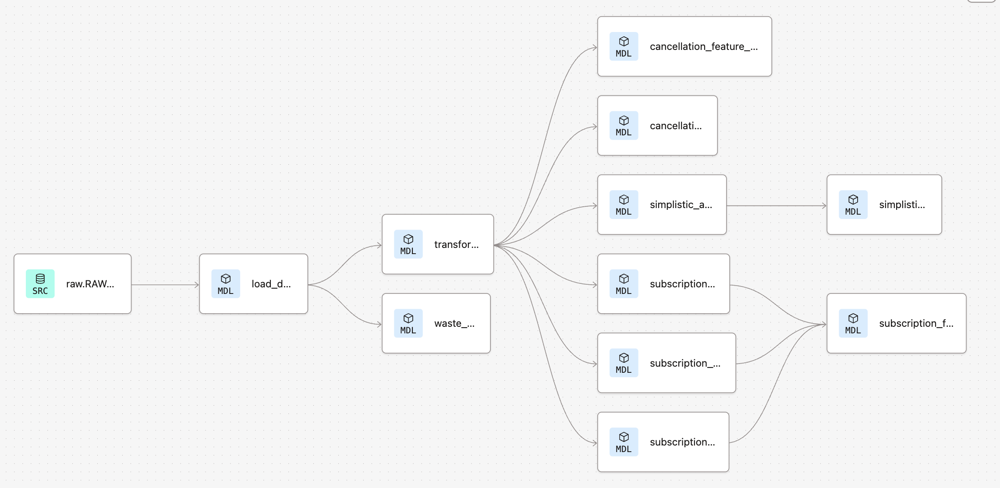

# Tractive Task

This project is a complete end-to-end dbt pipeline designed for analyzing subscription and cancellation behavior for Tractive's services.

Due to lack of real production data, I considered two analytical approaches: **Simplistic** and **Fact Table-Based**.

### 1. Simplistic Approach
This method relies on a single transformation model that aggregates cancellations and creations per `subscription_id` and calculates two key metrics:
- **cancellation_rate**: Ratio of subscriptions with at least one cancellation.
- **cancellation_rate_feature_performance**: Total cancellations divided by the number of created subscriptions.

### 2. Fact Table-Based Approach
This method normalizes the event data into three core dimensions:
- `subscription_created`
- `subscription_cancelled`
- `subscription_expired`

These are then joined into a central **`subscription_fact_table`** to support advanced analytics and flexible metric calculations.

Each approach is designed to highlight cancellation patterns under different assumptions and data availability constraints.

---

## Project Structure

```text
dbt_project/
│
├── models/
│   ├── load_data.sql                    
│   ├── transformation.sql                
│   ├── waste_data.sql                    
│   └── marts/
│       └── events/
│           ├── subscription_cancelled.sql
│           ├── subscription_created.sql
│           ├── subscription_expired.sql
│           ├── subscription_fact_table.sql
│           └── schema.yml
│       └── metrics/
│           ├── cancellation_feature_performance.sql
│           ├── cancellation_rate.sql
│           ├── simplistic_approach.sql
│           ├── simplistic_rates.sql
│           └── schema.yml
│   └── staging/
│       ├── load_data.sql
│       └── schema.yml
│   └── target/
│   └── transformation/
│       ├── transformation.sql
│       ├── waste_data.sql
│       └── schema.yml
│
├── schema.yml                            
├── dbt_project.yml                       
└── README.md                            
```

---

## How to Run

### 1. Install dependencies

```bash
pip install dbt-snowflake
```

---

### 2. Set up your Snowflake profile

Access to the Snowflake environment is only available if I receive your email and grant access to the compute cluster.

- If access is granted, you can proceed with this step.
- Otherwise, skip this step (you will not have access to the database).

To proceed:
1. In **dbt Cloud**, go to `Profile → CLI → Download CLI Configuration File`.
2. Update your local `~/.dbt/profiles.yml` file with the credentials.

---

### 3. Run the models

```bash
dbt run
```

---

### 4. Test the models

```bash
dbt test
```

---

### 5. Generate and view documentation

```bash
dbt docs generate
dbt docs serve
```

---

## Metrics Definitions

- **Cancellation Rate**: Ratio of subscriptions that had at least one cancellation event.
- **Cancellation Rate Feature Performance**: Ratio of all cancellation events (including duplicates) to created subscriptions.

---

## Notes

- Final metric outputs are stored in `simplistic_rates`.
- Project follows modular modeling: **staging → transformation → metrics**.
- Data source: `RAW.RAW_DATA` in Snowflake.

---

## Project Linage



---

## Contact

For questions or issues, feel free to contact:  
📧 `hermannsamimi@gmail.com`

---

✅ Good luck and thank you!
